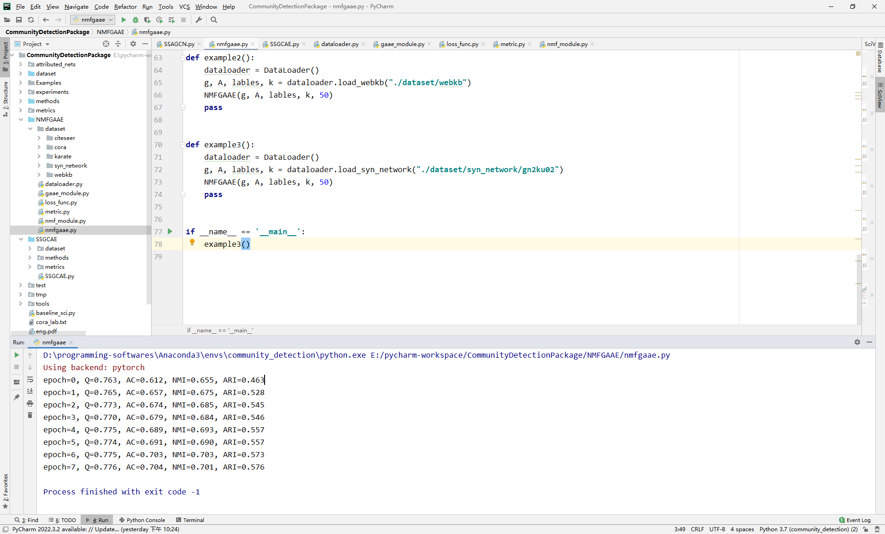

# NMFGAAE
The code of "Boosting nonnegative matrix factorization based community detection with graph attention auto-encoder"

Chaobo He, Yulong Zheng, Xiang Fei, Hanchao Li, Zeng Hu, Yong Tang. Boosting nonnegative matrix factorization based community detection with graph attention auto-encoder. IEEE Transactions on Big Data, 2022:8(4):968-981.

  

